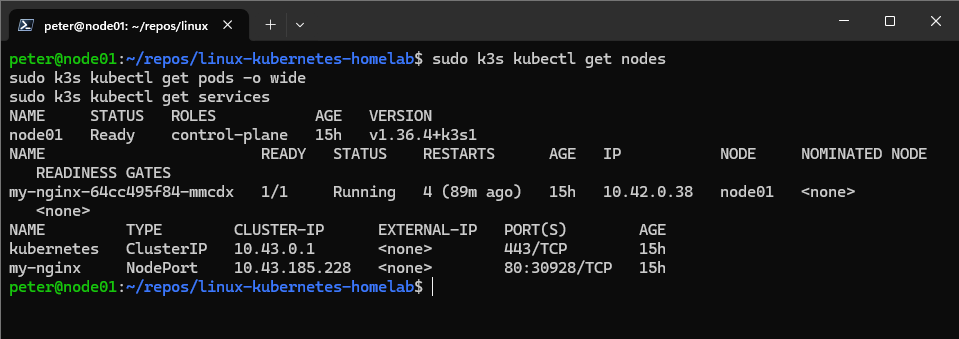
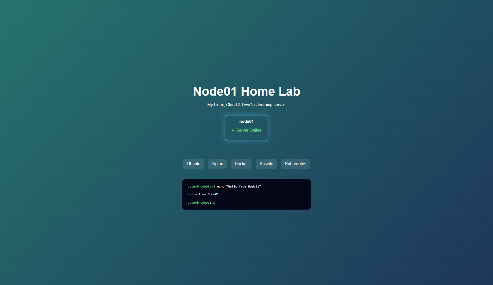

# Linux Kubernetes Home Lab

A hands-on home lab built to develop practical Linux, networking,
containerisation and Kubernetes administration skills.

The lab runs on a repurposed HP laptop using Ubuntu Server and is
administered remotely from a Windows workstation.

## Architecture

```text
Windows ThinkPad
      |
      +-- Local network --> SSH / Wake-on-LAN
      |
      +-- Remote network --> Tailscale --> SSH
                                      |
                                      v
                             Ubuntu Server (node01)
                                      |
                                      +-- Nginx
                                      +-- Docker
                                      +-- K3s
                                            |
                                            +-- Kubernetes Deployment
                                            +-- Nginx Pod
                                            +-- ConfigMap
                                            +-- NodePort Service
```

## Technologies

- Ubuntu Server
- Linux / Bash
- SSH with Ed25519 key authentication
- Tailscale
- Wake-on-LAN
- Nginx
- Docker
- K3s / Kubernetes
- UFW
- Git

## Secure Remote Access

The server can be administered securely from outside the home network
using Tailscale.

Tailscale provides encrypted private connectivity between the Windows
administration workstation and the Ubuntu server without exposing SSH
through router port forwarding.

Remote access was tested from an external mobile network to verify that
the server remained reachable outside the local network. During testing,
Tailscale successfully provided connectivity through a DERP relay when
a direct peer-to-peer connection could not be established.

OpenSSH is configured to use Ed25519 public-key authentication, with
password authentication disabled. UFW is enabled with a default-deny
policy for incoming traffic.

## Kubernetes Application

The project deploys an Nginx web application to a single-node K3s
cluster.

The Kubernetes configuration is stored declaratively in:

```text
kubernetes/
├── configmap.yaml
├── deployment.yaml
└── service.yaml
```

The Deployment mounts the website into the Nginx container using a
ConfigMap.

A NodePort Service exposes the application on the local network.

## Kubernetes Features Tested

During the lab I tested:

- Pod deployment and lifecycle management
- Kubernetes self-healing by manually deleting a Pod
- Horizontal scaling from one to three replicas
- ConfigMap volume mounting
- NodePort networking
- Server-side manifest validation
- Automatic K3s startup following a server reboot

## Demo

### Kubernetes Status

The cluster is running a healthy single-node K3s environment with the
Nginx workload exposed through a NodePort Service.



### Deployed Website

The Nginx workload serves the Node01 Home Lab website from Kubernetes.



## Wake-on-LAN

The server is configured for persistent Ethernet Wake-on-LAN.

A PowerShell function on the Windows administration machine sends a
Magic Packet to node01, allowing the physical server to be powered on
remotely before connecting over SSH.

## Repository Structure

```text
.
├── kubernetes/
│   ├── configmap.yaml
│   ├── deployment.yaml
│   └── service.yaml
├── website/
│   └── index.html
├── docs/
│   └── architecture.md
├── screenshots/
│   ├── kubernetes-status.png
│   └── website-demo.png
├── .gitignore
└── README.md
```

## Next Steps

Planned extensions to the lab include:

- Ansible configuration management
- Infrastructure as Code with Terraform
- Additional Kubernetes workloads
